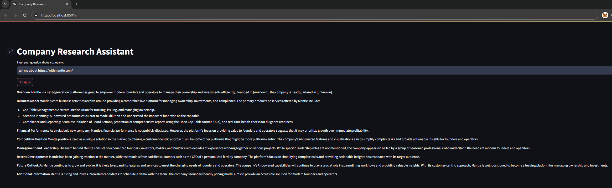

# Company Research Tool

## Overview

This web-based application generates detailed reports about companies using a combination of Dockerized services.
It incorporates a Streamlit web interface, a backend Python application using LangGraph to orchestrate an AI agent workflow, and Redis for caching.
The application leverages a local LLM model (Llama 3) to analyze and synthesize information about companies.



## Features

- **AI-Driven Reports**: Leverages a local LLM model and LangGraph to generate comprehensive reports on company operations, financials, and market position.
- **Caching**: Employs Redis to enhance performance by reducing data retrieval times.
- **Interactive Interface**: Streamlit-powered frontend for an intuitive user experience.

## Prerequisites

- Docker and Docker Compose
- Python (for non-Docker components)

## Quick Start

1. **Clone and navigate to repo**
   ```bash
   git clone https://github.com/Luca-Castelli/company-research.git
   cd company-research
   ```
2. **Run Docker Compose**
   ```bash
   docker-compose up --build
   ```

## Usage

Access the web interface at http://localhost:8501. Enter in a company website URL and click "Analyze" to generate the report.
